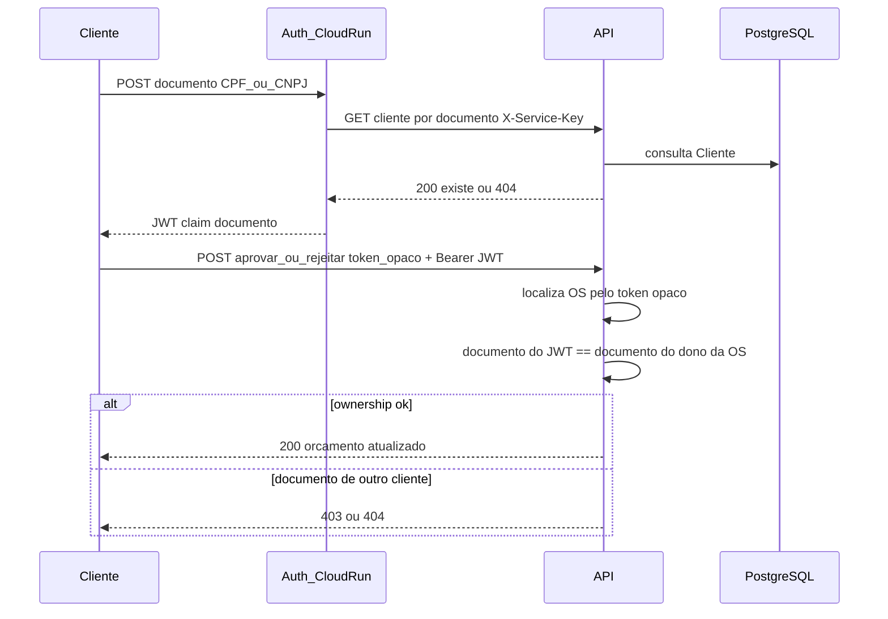

# auth

Cloud Function CPF → JWT (auth cliente) — Tech Challenge FIAP ([fiap-vcosta](https://github.com/fiap-vcosta)).

Valida CPF via API (HTTPS + secret de serviço) e emite JWT de cliente com secret **separado** do JWT staff. Coexiste com o token opaco de aprovação na API.

## Stack

- **Runtime:** Node.js **22.23.2** — pin em [`.nvmrc`](.nvmrc)
- **Framework:** [Functions Framework](https://github.com/GoogleCloudPlatform/functions-framework-nodejs) **5.x** (alvo Cloud Functions 2nd gen)
- **CI:** jobs separados de lint (summary error/warning) e testes unitários (summary de cobertura)
- **CD:** merge em `main` → **build-push** da imagem no Artifact Registry; o serviço Cloud Run é criado/atualizado/destruído pelo **`tf-apply` / `tf-destroy` do [`infra-k8s`](https://github.com/fiap-vcosta/infra-k8s)** (mesmo ciclo da demo)

## Decisões (ADRs)

Ver [`docs/README.md`](docs/README.md).

## Contrato HTTP (local)

`POST /` com body `{ "documento": "92561324354" }` → `{ "token": "<JWT>" }`.

Aceita **CPF ou CNPJ** válidos (`cpf-cnpj-validator`). O JWT usa claim **`documento`** (contrato alinhado à API).

Erros de validação: `{ "errors": ["Documento inválido."] }`. Cliente inexistente: Problem Details **404**.

A Function chama `GET {API_BASE_URL}/api/system/clientes/por-documento/{documento}` com header `X-Service-Key`.

## Sequência de autenticação

Fluxo completo até aprovar/rejeitar orçamento (token opaco da OS **permanece**; o JWT só prova identidade):



1. Cliente envia `{ "documento" }` ao auth.
2. Auth valida o documento e consulta a API com secret de serviço (`X-Service-Key`).
3. Auth emite JWT cliente (claim `documento`, exp 1800s) com secret **separado** do JWT staff.
4. Cliente chama aprovar/rejeitar na API com `Authorization: Bearer <JWT>` **e** `?token=` opaco.
5. A API localiza a OS pelo opaco e exige que o documento do JWT seja o do cliente dono da OS.

Entrada oficial na demo (HTTPS nomeado + API Gateway `/auth` + `/api`) vive no [`infra-k8s`](https://github.com/fiap-vcosta/infra-k8s); este repo só publica a imagem.

## Desenvolvimento local

### 1. API (repo `api`)

```bash
cd ../api
cp .env.example .env   # se ainda não tiver
docker compose --profile app up -d --build
curl -sS http://localhost:8080/health
```

Use os **mesmos** valores de `JWT_CLIENTE_*` e `SERVICE_AUTH_KEY` no `.env` deste repo.  
Cliente de teste local: documento **`92561324354`** (já cadastrado na sua API).

### 2. Auth

```bash
nvm use
cp .env.example .env
npm ci
npm run lint
npm test
npm run test:coverage
```

Subir a Function (escolha um):

```bash
npm start
# ou
docker compose up -d --build
```

### 3. Requestly (smoke HTTP)

Pasta: [`docs/requestly/`](docs/requestly/)

1. Importe `auth.requestly.json` (exploratória) e/ou `auth-e2e-tests.requestly.json`
2. Environment **Local** (`authUrl=http://localhost:8081`, `documento=92561324354`)
3. Rode `00-emitir-jwt / emitir-token` ou a pasta e2e no Collection Runner

- `.env.example` — modelo local (copiar para `.env`)
- `.env.test` — valores dummy dos testes
- `.env` — local, **não** versionado
- Auth em **`:8081`**; API em **`:8080`**
- No Docker, `API_BASE_URL` padrão é `http://host.docker.internal:8080`

| Variável | Papel |
|----------|--------|
| `API_BASE_URL` | Base da API |
| `JWT_CLIENTE_KEY` | Secret HS256 do JWT cliente (mesmo da API) |
| `JWT_CLIENTE_ISSUER` / `JWT_CLIENTE_AUDIENCE` | `tech-challenge-cliente` |
| `SERVICE_AUTH_KEY` | Header `X-Service-Key` |

JWT expira em **1800s** (hardcoded).

## Deploy na GCP

Este repo só **publica a imagem**. O Cloud Run `auth` mora no Terraform do [`infra-k8s`](https://github.com/fiap-vcosta/infra-k8s) e sobe/desce com a demo.

1. **Merge em `main`** → workflow `build-push` →  
   `{region}-docker.pkg.dev/{project}/{repo}/auth:latest` (e tag do SHA)
2. Na janela de demo: `infra-k8s` → **`tf-apply`** (cluster + Cloud Run auth) — ver README do `infra-k8s`
3. **`tf-destroy`** do `infra-k8s` remove o auth junto com o cluster

Pré-requisitos do `build-push`:

1. Apply do `infra-bootstrap` (Artifact Registry + SA de CI com `artifactregistry.writer`)
2. Org vars: `GCP_PROJECT_ID`, `GCP_REGION`, `GCP_AR_REPOSITORY`, `GCP_WORKLOAD_IDENTITY_PROVIDER`, `GCP_SERVICE_ACCOUNT_EMAIL`

Secrets `JWT_CLIENTE_KEY` / `SERVICE_AUTH_KEY` e a var `API_BASE_URL` são consumidos no **`tf-apply` do `infra-k8s`**, não neste repo.

Smoke (após o apply do k8s; URL no output/Job Summary do `infra-k8s`):

```bash
curl -sS -X POST "$AUTH_URI" \
  -H 'content-type: application/json' \
  -d '{"documento":"92561324354"}'
```

## Agentes

Ver [AGENTS.md](AGENTS.md).
